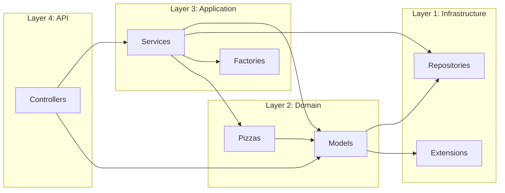

# Package Diagram - PizzaSolution

```mermaid
graph TD
    subgraph "PizzaSolution Solution"
        PizzaPlace[PizzaPlace<br/>ASP.NET Core Web API]
        Tests[PizzaPlace.Test<br/>MSTest Project]
    end
    
    subgraph "PizzaPlace Package"
        Controllers[Controllers<br/>API Endpoints]
        Models[Models<br/>DTOs & Domain]
        Services[Services<br/>Business Logic]
        Repositories[Repositories<br/>Data Access]
        Factories[Factories<br/>Pizza Ovens]
        Pizzas[Pizzas<br/>Domain Objects]
        Extensions[Extensions<br/>Helper Methods]
    end
    
    subgraph "Controllers Package"
        OC[OrderingController]
        MC[MenuController]
        RC[RestockingController]
        WC[WelcomeController]
    end
    
    subgraph "Models Package"
        DTO[Dto Base Class]
        Order[PizzaOrder, PizzaAmount]
        Stock[StockDto]
        Recipe[RecipeRecipeDto, PizzaPrepareOrder]
        Menu[Menu, MenuItem]
        Types[Enums: StockType, PizzaRecipeType]
    end
    
    subgraph "Services Package"
        OS[OrderingService]
        SS[StockService]
        RS[RecipeService]
        MS[MenuService]
    end
    
    subgraph "Repositories Package"
        ISR[IStockRepository]
        IRR[IRecipeRepository]
        FSR[FakeStockRepository]
        FRR[FakeRecipeRepository]
        DB[FakeDatabase~T~]
    end
    
    subgraph "Factories Package"
        IPO[IPizzaOven]
        PO[PizzaOven Base]
        NPO[NormalPizzaOven]
        ALPO[AssemblyLinePizzaOven]
        GRPO[GiantRevolvingPizzaOven]
    end
    
    subgraph "Pizzas Package"
        PizzaBase[Pizza Abstract]
        SP[StandardPizza]
        ETP[ExtremelyTastyPizza]
    end
    
    subgraph "Extensions Package"
        EE[EnumerableExtension]
        PHE[PizzaHelperExtensions]
        SE[StringExtensions]
    end
    
    Controllers --> Services
    Services --> Repositories
    Services --> Factories
    Models --> Pizzas
    
    Controllers --> Models
    Services --> Models
    Repositories --> Models
    Extensions --> Models
    
    PizzaPlace --> Tests
```

## Package Dependencies

## Namespace Structure

| Namespace | Classes |
|-----------|---------|
| PizzaPlace | ComparableList~T~, PizzaException, Dto |
| PizzaPlace.Controllers | OrderingController, MenuController, RestockingController, WelcomeController |
| PizzaPlace.Models | PizzaOrder, PizzaAmount, StockDto, PizzaRecipeDto, PizzaPrepareOrder, Menu, MenuItem |
| PizzaPlace.Models.Types | StockType, PizzaRecipeType |
| PizzaPlace.Services | OrderingService, StockService, RecipeService, MenuService |
| PizzaPlace.Repositories | IStockRepository, IRecipeRepository, FakeStockRepository, FakeRecipeRepository |
| PizzaPlace.Factories | IPizzaOven, PizzaOven, NormalPizzaOven, AssemblyLinePizzaOven, GiantRevolvingPizzaOven |
| PizzaPlace.Pizzas | Pizza, StandardPizza, ExtremelyTastyPizza |
| PizzaPlace.Extensions | EnumerableExtension, PizzaHelperExtensions, StringExtensions |
