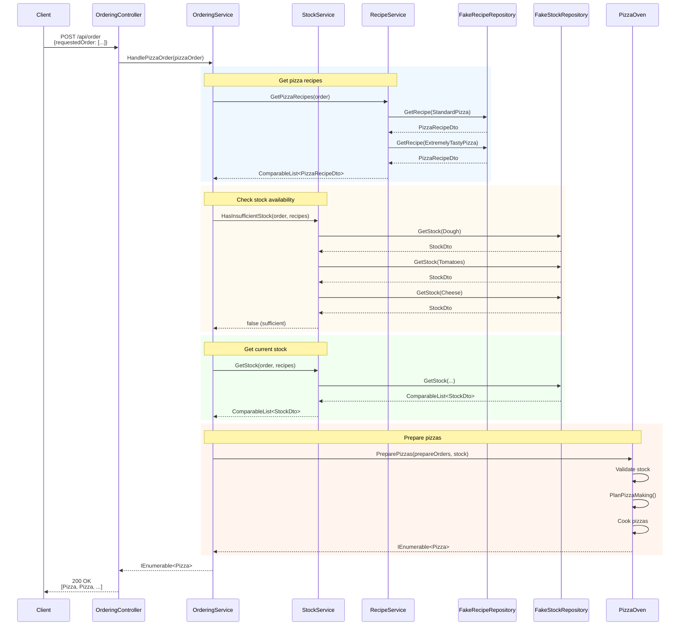
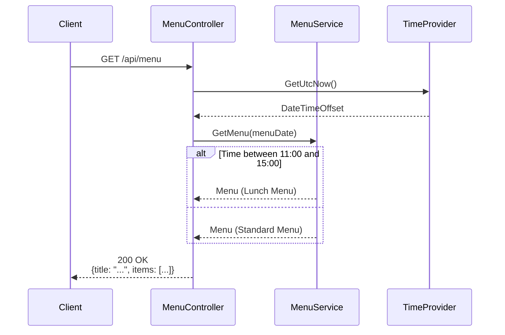
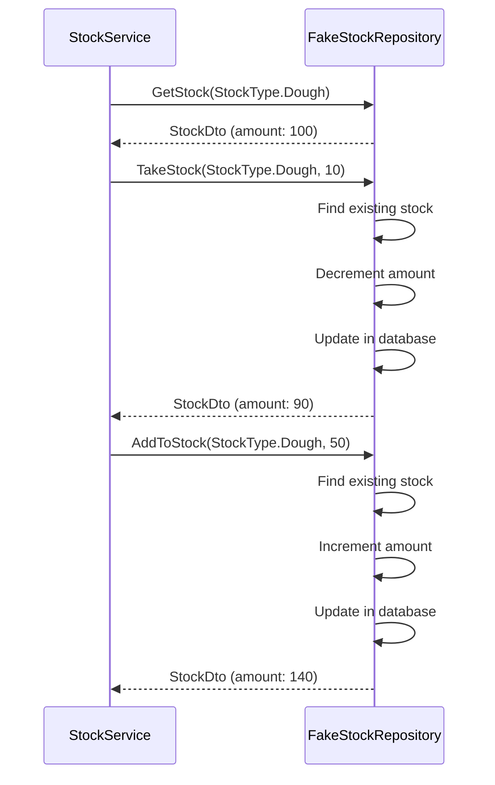
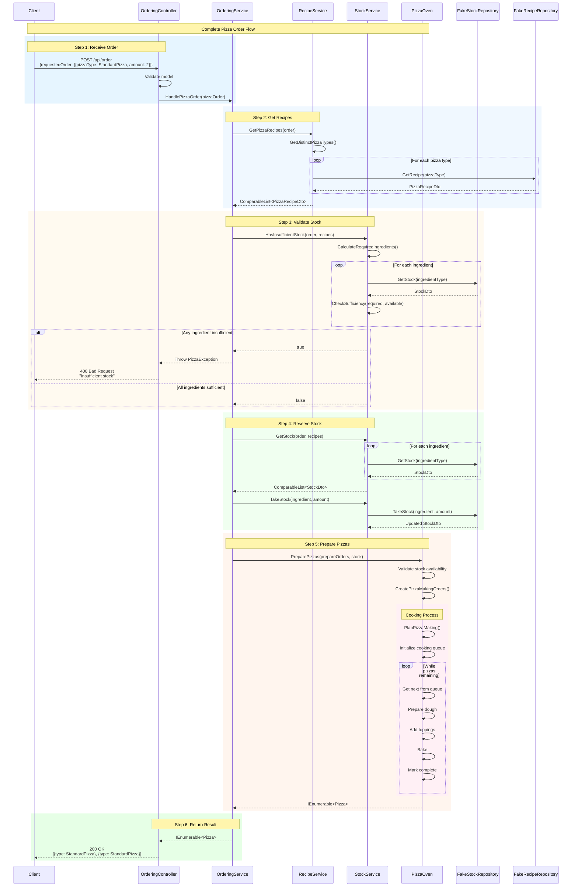
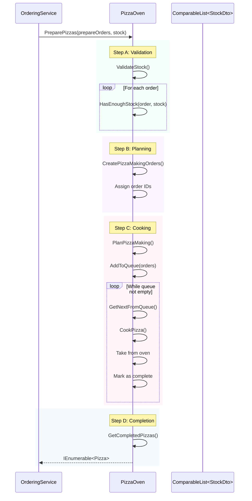

# Sequence Diagrams - PizzaSolution

## Use Case 1: Place Pizza Order

## Use Case 2: Get Menu

## Use Case 3: Stock Management (Check & Take)

---

## Pizza Order & Completion Flow

## Detailed PizzaOven Preparation Flow

